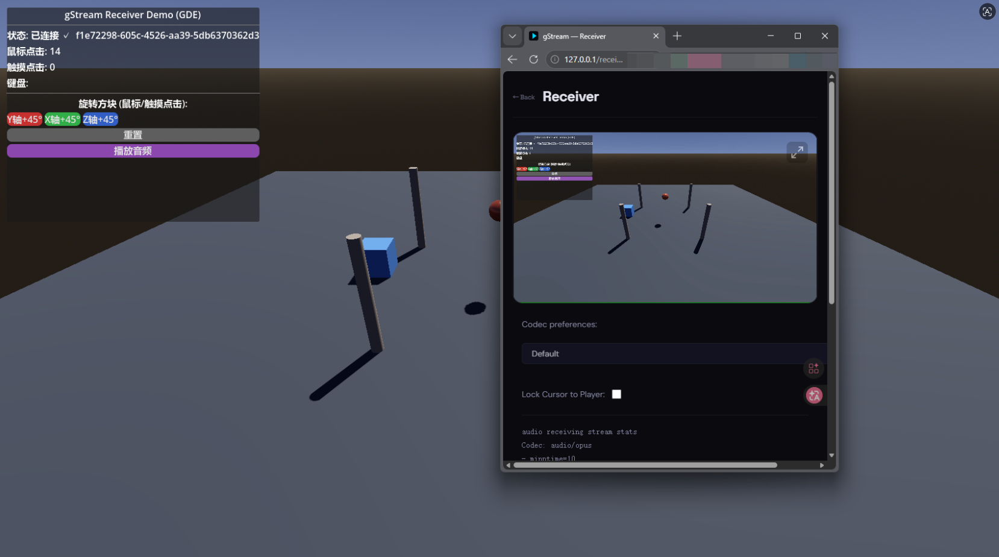

#  gStream

[中文文档](README_CN.md)

High-performance real-time video streaming for Godot — encode game frames and stream them to browsers via WebRTC with hardware-accelerated encoding.



## Features

- 🎮 **Godot Native** — GDExtension plugin with zero-GC viewport capture and C# fallback
- 📺 **WebRTC Streaming** — Millisecond latency with keyboard/mouse/gamepad input relay
- 🚀 **Multi-Codec** — H264 / H265 / AV1 / VP9 with auto GPU encoder selection (NVENC / QSV / AMF / VAAPI)
- 📦 **Native AOT** — Core library compiles to native DLL/SO, callable from C++ engines (UE5, etc.) via C API
- 📱 **Cross-Platform** — Windows / Linux / macOS

## Quick Start

### Option 1: GDExtension (Recommended)

Download the latest `gstream-v*-gde-win-x64.zip` from [Releases](https://github.com/youfch/gstream/releases), extract into your Godot project, and enable the plugin.

### Option 2: Godot .NET Plugin

1. Copy `demo/gstream-godot/addons/gstream/` into your Godot project's `addons/gstream/`
2. Enable the plugin in Project → Project Settings → Plugins
3. Add a `StreamServer` node to your scene

### Signaling Server

```bash
cd src/gstream-webapp
npm install && npm run build
npm start   # Listens on port 80, use --port to change
```

## Requirements

| Component | Version |
|-----------|---------|
| Godot | 4.6+ (standard for GDE, .NET for C# plugin) |
| .NET SDK | 10.0 |
| Node.js | 18+ (signaling server) |
| OS | Windows 10+ / Linux x64 / macOS |

## Supported Encoders

| GPU | H264 | H265 | AV1 |
|-----|------|------|-----|
| NVIDIA NVENC (GTX 9xx+) | ✅ | ⚠️ | — |
| NVIDIA NVENC (RTX 40+) | ✅ | ✅ | ✅ |
| Intel QSV (Arc / 11th Gen+) | ✅ | ✅ | ✅ |
| AMD AMF (RX 5000+) | ✅ | ✅ | ⚠️ |
| Apple VideoToolbox | ✅ | ✅ | — |
| Software (libx264/libvpx) | ✅ | — | ✅ |

## Codec Quick Reference

```csharp
streamServer.Codec = VideoCodec.Auto;            // Auto-negotiate (recommended)
streamServer.Codec = VideoCodec.H264_High_L31;   // Best compatibility
streamServer.Codec = VideoCodec.AV1_Main_L5;     // Best quality (RTX 40+)
streamServer.Codec = VideoCodec.VP9_Profile0;    // Royalty-free (CPU)
```

Full codec table and SDP details → [README_CN.md § 编解码器支持](README_CN.md#编解码器支持)

## Architecture

```
Godot Engine
├── StreamServer (Node)
│   ├── ViewportCapture → FFmpeg Encoder
│   └── WebRTC Streamer → Signaling Server → Browser
└── gstream_native (C++ GDExtension, optional)
```

Detailed architecture diagrams → [README_CN.md § 架构](README_CN.md#架构)

## Project Structure

```
src/
├── gStream.Core/          # Core library (encoding / WebRTC / signaling)
├── gStream.GDExtension/   # Native AOT GDExtension
├── gstream-webapp/        # Signaling server + web client (TypeScript / Express)
demo/
├── gstreamGodot/          # Godot .NET demo
└── gstreamGdedemo/        # GDExtension demo (no .NET SDK required)
```

## Build from Source

### Godot Plugin (C#)

```bash
cd demo/gstreamGodot
dotnet build
```

### Native AOT DLL (for C++ engines)

```bash
# Windows x64
dotnet publish src/gStream.Core/gStream.Core.csproj -r win-x64 -c Release -p:PublishAot=true

# Linux x64
dotnet publish src/gStream.Core/gStream.Core.csproj -r linux-x64 -c Release -p:PublishAot=true
```

### Signaling Server

```bash
cd src/gstream-webapp
npm install && npm run build
npm start
```

Full build guide → [README_CN.md § 从源码构建](README_CN.md#从源码构建)

## Exported C API (Native AOT)

| Function | Description |
|----------|-------------|
| `gstream_session_create(w, h, fps, bitrate, codec, preset, url, addr, recv)` | Create streaming session |
| `gstream_push_frame(session, w, h, stride, data)` | Push BGRA32 frame |
| `gstream_push_frame_direct(session, w, h, stride, data)` | Push frame (zero-copy) |
| `gstream_push_audio(session, samples, count)` | Push float32 PCM samples |
| `gstream_force_keyframe(session)` | Force next frame as keyframe |
| `gstream_is_connected(session)` | Check WebRTC connection status |
| `gstream_session_destroy(session)` | Destroy session |

Complete API reference → [README_CN.md § 导出的 C API](README_CN.md#导出的-c-api)

## Known Issues

- **H265 WebRTC** — Chrome requires experimental flag, Firefox not supported. Use AV1 or H264 instead.

## License

MIT
